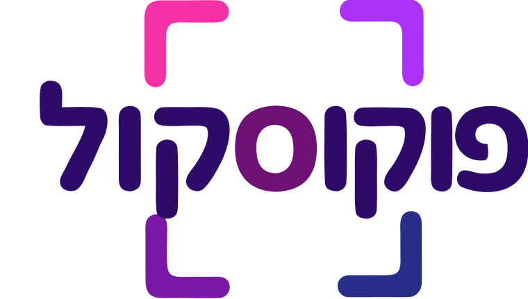

<p align="center"></p>

# פוקוסקול — FocuSchool

כלי קוד-פתוח שעוזר לבית ספר להפעיל אתר בית-ספרי חי, זורם וכייפי — כמעט לגמרי אוטומטי, וללא עלות.
עדכון האתר מהנייד בשלושה שדות; זיהוי הרשאות אוטומטי לפי מייל; הכול על שכבות חינם.

- 📖 [החזון המלא](docs/VISION.md) · 🏗️ [ארכיטקטורה](docs/ARCHITECTURE.md) · 📋 [מפרט מלא (SPEC)](docs/SPEC.md)
- 🌐 דמו חי: https://focuschool.chepti.com

## סטאק

Next.js 16 (App Router) · TypeScript · Tailwind CSS v4 · Firebase (Firestore, Auth, Cloud Messaging) · Vercel

> **אילוץ מוביל:** הכול רץ על שכבות חינם בלבד — **Vercel Hobby + Firebase Spark**.
> אין Cloud Functions (הלוגיקה ב-App Routes של Next), אין Firebase Storage (תמונות = קישורי Google Photos/Drive).

---

## 🏫 להקים עותק עצמאי לבית הספר שלכם

המודל הוא **"מעתיקים ומריצים"**: כל בית ספר מעתיק את הקוד, מחבר Firebase ו-Vercel **משלו**, ומקבל אתר עצמאי לחלוטין — מסד נתונים נפרד, דומיין נפרד, אפס תלות בבית ספר אחר ואפס עלות.

הזמן המשוער: כ-30–45 דקות. לא נדרש ידע בתכנות מעבר להעתקה והדבקה של מפתחות.

### שלב 1 — Firebase (בחינם, ללא כרטיס אשראי)

1. היכנסו ל-[console.firebase.google.com](https://console.firebase.google.com) וצרו פרויקט חדש (תוכנית **Spark**).
2. **Firestore Database** → Create database → מצב Production, אזור `me-west1` (תל אביב) או הקרוב אליכם.
3. **Authentication** → Get started → הפעילו את ספק **Google**.
4. **Project settings → General → Your apps** → הוסיפו אפליקציית Web (</>). העתיקו את ערכי הקונפיג ל-`.env` (ראו שלב 3).
5. **Cloud Messaging** (לנוטיפיקציות): Project settings → Cloud Messaging → תחת *Web configuration* → *Web Push certificates* → Generate key pair. זה ה-`NEXT_PUBLIC_FCM_VAPID_KEY`.
6. **Service account** (לשליחת נוטיפיקציות מהשרת): Project settings → Service accounts → Generate new private key → יורד קובץ JSON. שמרו אותו — יהפוך ל-`FIREBASE_SERVICE_ACCOUNT` (שלב 3). **זהו סוד — לא להעלות ל-git.**

### שלב 2 — העתקת הקוד

```bash
# Fork ב-GitHub, ואז:
git clone https://github.com/<your-username>/FocuSchool.git
cd FocuSchool
npm install
```

### שלב 3 — הגדרת משתני הסביבה

העתיקו את [`.env.example`](.env.example) ל-`.env.local` ומלאו את הערכים מהשלבים הקודמים:

```bash
cp .env.example .env.local
```

עיקר המשתנים:

| משתנה | מאיפה | סוד? |
|---|---|---|
| `NEXT_PUBLIC_FIREBASE_*` (6) | קונפיג ה-Web app (שלב 1.4) | לא |
| `NEXT_PUBLIC_SCHOOL_ID` | מזהה קצר באנגלית, למשל `ofek` | לא |
| `NEXT_PUBLIC_SCHOOL_NAME` / `_CITY` | שם ועיר בית הספר | לא |
| `NEXT_PUBLIC_SITE_URL` | כתובת הפרודקשן (מ-Vercel, שלב 5) | לא |
| `NEXT_PUBLIC_FCM_VAPID_KEY` | Web Push key (שלב 1.5) | לא |
| `FIREBASE_SERVICE_ACCOUNT` | תוכן ה-JSON כשורה אחת (שלב 1.6) | **כן** |

> **טיפ ל-`FIREBASE_SERVICE_ACCOUNT`:** הדביקו את כל תוכן קובץ ה-JSON כערך יחיד. ב-Vercel אפשר להדביק דרך ה-CLI כדי לעקוף בעיות הדבקה:
> ```bash
> Get-Content service-account.json -Raw | vercel env add FIREBASE_SERVICE_ACCOUNT production
> ```

### שלב 4 — פריסת חוקי האבטחה וזריעת נתונים ראשונית

```bash
npm install -g firebase-tools
firebase login
firebase use <your-project-id>

# חוקי האבטחה (חובה — בלעדיהם המסד חסום או פרוץ):
firebase deploy --only firestore:rules

# זריעת בית ספר התחלתי + האדמין הראשון (אתם):
$env:SEED_ADMIN_EMAIL="you@gmail.com"; npm run seed
```

הזריעה יוצרת בית ספר עם תוכן דמו כנקודת פתיחה (רצועות, אירועים, מערכת שעות לדוגמה) ומגדירה אתכם כאדמין. הכול ניתן לעריכה אחר-כך מתוך האתר.

### שלב 5 — פריסה ל-Vercel

1. ב-[vercel.com](https://vercel.com) → New Project → ייבאו את ה-fork שלכם (תוכנית **Hobby**).
2. הוסיפו את **כל** משתני הסביבה מ-`.env.local` תחת Project Settings → Environment Variables.
3. Deploy. קבלו כתובת `https://<your-app>.vercel.app` — עדכנו אותה ב-`NEXT_PUBLIC_SITE_URL` ופרסו מחדש.
4. **חשוב:** ב-Firebase → Authentication → Settings → Authorized domains → הוסיפו את הדומיין של Vercel, אחרת התחברות Google תיכשל.

### שלב 6 — עלייה לאוויר

היכנסו לאתר, התחברו עם חשבון ה-Google של האדמין, ומ-`/members` הדביקו את רשימת ההורים (מאקסל). מכאן והלאה ההורים מזוהים אוטומטית בהתחברות. 🎉

> **תזכורת יומית (תזכורות מתוזמנות):** קובץ `vercel.json` כבר מגדיר Vercel Cron יומי ל-`/api/messages/dispatch`. ב-Hobby ה-Cron רץ פעם ביום — מספיק לתזכורות ולסיכומי digest.

---

## 👨‍👩‍👧 הורים ומורים שחברים ביותר מבית ספר אחד

מכיוון שכל בית ספר הוא התקנה **עצמאית לגמרי** (fork נפרד, Firebase נפרד, דומיין נפרד), הנה מה שקורה למי ששייך לכמה בתי ספר — וזו התנהגות מכוונת:

- **התחברות:** אותו חשבון Google עובד בכל בתי הספר. אין סיסמאות ואין הרשמה מחדש — בכל אתר המשתמש מזוהה לפי המייל שלו מול רשימת החברים של **אותו** בית ספר. הורה עם ילדים בשני בתי ספר פשוט נכנס לשתי הכתובות עם אותו חשבון.
- **הפרדה מלאה = פרטיות:** אף בית ספר לא רואה את הנתונים של אחר. אין מסד משותף, אין דליפה בין קהילות. זו התכונה, לא הבאג.
- **PWA נפרד לכל בית ספר:** כל אתר מותקן כאפליקציה נפרדת על המסך (אייקון ושם משלה — לכן חשוב למלא `NEXT_PUBLIC_SCHOOL_NAME`). ההורה יודע תמיד באיזה בית ספר הוא נמצא.
- **נוטיפיקציות נפרדות:** כל בית ספר שולח מה-Firebase שלו, כך שהתראות בית ספר א' מגיעות מהאפליקציה של א' ושל ב' מזו של ב' — בלי ערבוב. אין תיבת-דואר מאוחדת, וזה הפשרה המקובלת בתמורה לפרטיות ולעלות אפס.

> **⚠️ למפעילים:** אל תארחו שני בתי ספר על **אותו דומיין/פריסה**. הדפדפן מתיר Service Worker אחד של FCM לכל origin, וסשן ההתחברות הוא לכל origin — שני בתי ספר על אותו origin יתנגשו. מודל ה-fork-per-school נמנע מכך מעצם הבנייה (origin נפרד לכל בית ספר).

---

## הרצה מקומית

```bash
npm install
npm run dev      # http://localhost:3000
```

בלי `.env.local` האתר עולה מול פרויקט הדמו (ברירות מחדל ב-`src/lib/config.ts`), עם נסיגה אוטומטית לנתוני דמו מקומיים אם אין רשת.

## מבנה

```
src/app/         דף הבית, /add /manage /members /message /checklists /signups /committee /help
                 api/push (בדיקת FCM), api/messages/dispatch (הודעות מתוזמנות + digest)
src/components/  StripRow, ParentZone (האזור האישי), פאנלים (Checklists/Signups/Polls), ...
src/lib/         config (כל ההגדרות הניתנות לשינוי!), firebase, data, push, push-server, types
scripts/seed.ts  זריעת נתונים ראשונית (npm run seed)
firestore.rules  חוקי אבטחה (firebase deploy --only firestore:rules)
```

## רישיון

קוד פתוח לשימוש חופשי של בתי ספר. תרומות בברכה.
